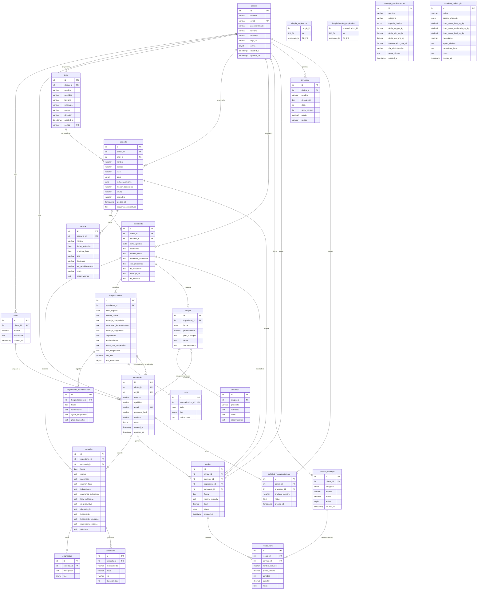

# 🗄️ Documentación Completa de la Base de Datos — ANA-vet

**Sistema:** ANA-vet — Clínica Veterinaria SaaS Multi-tenant  
**Motor:** MySQL / MariaDB 10.4 · InnoDB · utf8mb4_general_ci  
**Versión del esquema:** v3.0 (Mayo 2026)  
**Archivos fuente:** `schema.sql`, `migration_saas.sql`, `migration_empleados_medicos.sql`, `migration_recibos.sql`

---

## 📋 Tabla de Contenidos

1. [Resumen General](#1-resumen-general)
2. [Diagrama Entidad-Relación (ERD)](#2-diagrama-entidad-relación-erd)
3. [Módulos de la Base de Datos](#3-módulos-de-la-base-de-datos)
4. [Descripción Detallada de Tablas](#4-descripción-detallada-de-tablas)
5. [Claves Primarias](#5-claves-primarias)
6. [Claves Foráneas y Restricciones](#6-claves-foráneas-y-restricciones)
7. [Claves Candidatas y Únicas](#7-claves-candidatas-y-únicas)
8. [Índices de Rendimiento](#8-índices-de-rendimiento)
9. [Columnas ENUM y Valores Controlados](#9-columnas-enum-y-valores-controlados)
10. [Arquitectura Multi-tenant (clinica_id)](#10-arquitectura-multi-tenant-clinica_id)
11. [Cadenas de Eliminación en Cascada](#11-cadenas-de-eliminación-en-cascada)
12. [Tablas Puente (Relaciones N:M)](#12-tablas-puente-relaciones-nm)
13. [Tablas de Catálogo (Solo Lectura)](#13-tablas-de-catálogo-solo-lectura)
14. [Tablas Implícitas (Inferidas del Código)](#14-tablas-implícitas-inferidas-del-código)
15. [Normalización y Forma Normal](#15-normalización-y-forma-normal)
16. [Depuración y Problemas Conocidos](#16-depuración-y-problemas-conocidos)
17. [Flujo de Datos por Módulo](#17-flujo-de-datos-por-módulo)
18. [Guía de Extensión del Esquema](#18-guía-de-extensión-del-esquema)

---

## 1. Resumen General

La base de datos `clinica_veterinaria` contiene **24 tablas** organizadas en 6 módulos funcionales. Fue construida en 4 fases:

| Fase | Archivo | Tablas creadas |
|------|---------|----------------|
| **Fase 1 — Core clínico** | `schema.sql` | `tutor`, `paciente`, `expediente`, `consulta`, `diagnostico`, `tratamiento`, `hospitalizacion`, `seguimiento_hospitalizacion`, `alta`, `cirugia`, `anestesia`, `vacuna` |
| **Fase 2 — Calculadoras** | `schema.sql` (sección 2) | `catalogo_medicamentos`, `catalogo_toxicologia` |
| **Fase 3 — SaaS Multi-tenant** | `migration_saas.sql` | `clinicas`, `roles`, `empleados` + columnas `clinica_id` en tablas existentes |
| **Fase 4 — Personal médico** | `migration_empleados_medicos.sql` | `cirugia_empleados`, `hospitalizacion_empleados` + columna `empleado_id` en `consulta` |
| **Fase 5 — Recibos** | `migration_recibos.sql` | `servicio_catalogo`, `recibo`, `recibo_item` |
| **Fase 6 — Inventario** *(implícita)* | No documentada en SQL | `inventario`, `solicitud_reabastecimiento` |

### Conteo de tablas por módulo

| Módulo | Tablas |
|--------|--------|
| Gestión de clientes | 2 (`tutor`, `paciente`) |
| Historial clínico | 8 (`expediente`, `consulta`, `diagnostico`, `tratamiento`, `hospitalizacion`, `seguimiento_hospitalizacion`, `alta`, `vacuna`) |
| Cirugía | 2 (`cirugia`, `anestesia`) |
| SaaS / Usuarios | 3 (`clinicas`, `roles`, `empleados`) |
| Asignación médica | 2 (`cirugia_empleados`, `hospitalizacion_empleados`) |
| Finanzas | 3 (`servicio_catalogo`, `recibo`, `recibo_item`) |
| Calculadoras | 2 (`catalogo_medicamentos`, `catalogo_toxicologia`) |
| Inventario | 2 (`inventario`, `solicitud_reabastecimiento`) |

---

## 2. Diagrama Entidad-Relación (ERD)

### 2.1 Diagrama Completo (Mermaid)



### 2.2 Diagrama Simplificado por Módulos (ASCII)

```
┌─────────────────────────────────────────────────────────────────────────────┐
│                         MÓDULO SAAS / USUARIOS                              │
│                                                                             │
│  ┌──────────┐    1:N    ┌──────────┐    N:1    ┌──────────────┐            │
│  │ clinicas │◄──────────│  roles   │◄──────────│  empleados   │            │
│  │  (PK:id) │           │ (PK:id)  │           │   (PK:id)    │            │
│  │  email UK│           │clinica_id│           │  email UK    │            │
│  └──────────┘           └──────────┘           └──────────────┘            │
│       │                                               │                     │
└───────┼───────────────────────────────────────────────┼─────────────────────┘
        │ clinica_id (FK)                               │ empleado_id (FK)
        ▼                                               ▼
┌─────────────────────────────────────────────────────────────────────────────┐
│                       MÓDULO CLIENTES / PACIENTES                           │
│                                                                             │
│  ┌──────────┐    1:N    ┌──────────────┐    1:N    ┌──────────────┐        │
│  │  tutor   │◄──────────│   paciente   │◄──────────│  expediente  │        │
│  │  (PK:id) │           │   (PK:id)    │           │   (PK:id)    │        │
│  │ codigo UK│           │  tutor_id FK │           │ paciente_id  │        │
│  └──────────┘           └──────────────┘           └──────────────┘        │
│                                │                          │                 │
│                                │ 1:N                      │ 1:N             │
│                                ▼                          ▼                 │
│                         ┌──────────┐          ┌──────────────────────┐     │
│                         │  vacuna  │          │ consulta / cirugia / │     │
│                         │ (PK:id)  │          │  hospitalizacion     │     │
│                         └──────────┘          └──────────────────────┘     │
└─────────────────────────────────────────────────────────────────────────────┘
        │
        ▼
┌─────────────────────────────────────────────────────────────────────────────┐
│                       MÓDULO HISTORIAL CLÍNICO                              │
│                                                                             │
│  expediente                                                                 │
│      │                                                                      │
│      ├──1:N──► consulta ──1:N──► diagnostico                               │
│      │              └──1:N──► tratamiento                                   │
│      │                                                                      │
│      ├──1:N──► hospitalizacion ──1:N──► seguimiento_hospitalizacion        │
│      │              └──1:1──► alta                                          │
│      │                                                                      │
│      └──1:N──► cirugia ──1:1──► anestesia                                  │
│                                                                             │
└─────────────────────────────────────────────────────────────────────────────┘
        │
        ▼
┌─────────────────────────────────────────────────────────────────────────────┐
│                         MÓDULO FINANZAS                                     │
│                                                                             │
│  ┌──────────────────┐    1:N    ┌──────────────┐    1:N    ┌────────────┐  │
│  │ servicio_catalogo│◄──────────│    recibo    │◄──────────│ recibo_item│  │
│  │    (PK:id)       │           │   (PK:id)    │           │  (PK:id)   │  │
│  │  clinica_id FK   │           │ clinica_id FK│           │ recibo_id  │  │
│  └──────────────────┘           └──────────────┘           └────────────┘  │
└─────────────────────────────────────────────────────────────────────────────┘
```

---

## 3. Módulos de la Base de Datos

### Módulo 1: SaaS / Usuarios
**Propósito:** Gestión de clínicas (tenants), roles y empleados del sistema.

| Tabla | Descripción |
|-------|-------------|
| `clinicas` | Registro maestro de cada clínica veterinaria (tenant). Contiene credenciales de acceso del administrador. |
| `roles` | Catálogo de puestos/roles por clínica (Veterinario, Recepcionista, Auxiliar, Administrador). |
| `empleados` | Personal de cada clínica. Cada empleado tiene credenciales propias y un rol asignado. |

### Módulo 2: Clientes y Pacientes
**Propósito:** Registro de propietarios (tutores) y sus animales.

| Tabla | Descripción |
|-------|-------------|
| `tutor` | Propietario del animal. Contiene datos de contacto y un código único generado automáticamente. |
| `paciente` | Animal registrado en la clínica. Vinculado a un tutor. |

### Módulo 3: Historial Clínico
**Propósito:** Registro completo del historial médico de cada paciente.

| Tabla | Descripción |
|-------|-------------|
| `expediente` | Carpeta médica del paciente. Punto de entrada para consultas, hospitalizaciones y cirugías. |
| `consulta` | Registro de cada visita médica. Incluye anamnesis, diagnóstico, tratamiento y seguimiento. |
| `diagnostico` | Diagnósticos individuales asociados a una consulta (presuntivo o definitivo). |
| `tratamiento` | Medicamentos prescritos en una consulta. |
| `hospitalizacion` | Registro de internamiento del paciente. |
| `seguimiento_hospitalizacion` | Notas de seguimiento diario durante la hospitalización. |
| `alta` | Registro del alta médica de una hospitalización. |
| `vacuna` | Historial de vacunación del paciente. |

### Módulo 4: Cirugía
**Propósito:** Registro de procedimientos quirúrgicos y protocolos anestésicos.

| Tabla | Descripción |
|-------|-------------|
| `cirugia` | Procedimiento quirúrgico vinculado a un expediente. |
| `anestesia` | Protocolo anestésico asociado a una cirugía (relación 1:1). |

### Módulo 5: Asignación de Personal Médico
**Propósito:** Vincular empleados a procedimientos clínicos.

| Tabla | Descripción |
|-------|-------------|
| `cirugia_empleados` | Tabla puente N:M. Múltiples empleados pueden participar en una cirugía. |
| `hospitalizacion_empleados` | Tabla puente N:M. Múltiples empleados pueden atender una hospitalización. |

### Módulo 6: Finanzas
**Propósito:** Gestión de cobros y recibos de pago.

| Tabla | Descripción |
|-------|-------------|
| `servicio_catalogo` | Catálogo de servicios con precios por clínica. |
| `recibo` | Encabezado del recibo de pago. Vincula cobro con paciente, expediente y empleado. |
| `recibo_item` | Líneas de detalle del recibo. Cada fila es un servicio cobrado. |

### Módulo 7: Calculadoras Clínicas
**Propósito:** Catálogos de referencia para las calculadoras médicas (solo lectura).

| Tabla | Descripción |
|-------|-------------|
| `catalogo_medicamentos` | Medicamentos veterinarios con dosis, concentración y notas clínicas. |
| `catalogo_toxicologia` | Toxinas con umbrales de riesgo (leve/moderado/letal) y protocolos de tratamiento. |

### Módulo 8: Inventario
**Propósito:** Control de stock de insumos y solicitudes de reabastecimiento.

| Tabla | Descripción |
|-------|-------------|
| `inventario` | Productos en stock de la clínica con alertas de nivel mínimo. |
| `solicitud_reabastecimiento` | Solicitudes de reabastecimiento creadas por empleados. |

---

## 4. Descripción Detallada de Tablas

### 4.1 `clinicas`
**Motor:** InnoDB · **Charset:** utf8mb4_general_ci

| Columna | Tipo | Nulo | Default | Descripción |
|---------|------|------|---------|-------------|
| `id` | int(11) | NO | AUTO_INCREMENT | **PK** — Identificador único de la clínica |
| `nombre` | varchar(150) | NO | — | Nombre comercial de la clínica |
| `email` | varchar(150) | NO | — | Correo de acceso/login. **UNIQUE** |
| `password_hash` | varchar(255) | NO | — | Contraseña hasheada con bcrypt (10 rounds) |
| `telefono` | varchar(20) | SÍ | NULL | Teléfono de contacto |
| `direccion` | varchar(255) | SÍ | NULL | Dirección física |
| `logo_url` | varchar(500) | SÍ | NULL | URL o ruta del logo |
| `activa` | tinyint(1) | NO | 1 | Estado: 1=activa, 0=suspendida |
| `created_at` | timestamp | NO | current_timestamp() | Fecha de registro |
| `updated_at` | timestamp | NO | current_timestamp() ON UPDATE | Última modificación |

---

### 4.2 `roles`
**Motor:** InnoDB · **Charset:** utf8mb4_general_ci

| Columna | Tipo | Nulo | Default | Descripción |
|---------|------|------|---------|-------------|
| `id` | int(11) | NO | AUTO_INCREMENT | **PK** |
| `clinica_id` | int(11) | NO | — | **FK** → `clinicas.id` ON DELETE CASCADE |
| `nombre` | varchar(100) | NO | — | Nombre del rol (Veterinario, Recepcionista, etc.) |
| `descripcion` | text | SÍ | NULL | Descripción de permisos y responsabilidades |
| `created_at` | timestamp | NO | current_timestamp() | Fecha de creación |

**Roles por defecto** (creados automáticamente al registrar una clínica):
- `Administrador` — Acceso total
- `Veterinario` — Expedientes, consultas, cirugías, hospitalizaciones
- `Recepcionista` — Registro de tutores, pacientes y citas
- `Auxiliar` — Apoyo en consultas y hospitalización

---

### 4.3 `empleados`
**Motor:** InnoDB · **Charset:** utf8mb4_general_ci

| Columna | Tipo | Nulo | Default | Descripción |
|---------|------|------|---------|-------------|
| `id` | int(11) | NO | AUTO_INCREMENT | **PK** |
| `clinica_id` | int(11) | NO | — | **FK** → `clinicas.id` ON DELETE CASCADE |
| `rol_id` | int(11) | NO | — | **FK** → `roles.id` ON DELETE RESTRICT |
| `nombre` | varchar(100) | NO | — | Nombre del empleado |
| `apellidos` | varchar(150) | NO | — | Apellidos del empleado |
| `email` | varchar(150) | NO | — | Correo de login. **UNIQUE** |
| `password_hash` | varchar(255) | NO | — | Contraseña hasheada con bcrypt |
| `telefono` | varchar(20) | SÍ | NULL | Teléfono de contacto |
| `activo` | tinyint(1) | NO | 1 | Estado: 1=activo, 0=dado de baja |
| `created_at` | timestamp | NO | current_timestamp() | Fecha de registro |
| `updated_at` | timestamp | NO | current_timestamp() ON UPDATE | Última modificación |

**Nota:** El sistema puede autogenerar correos institucionales con el formato `nombre.apellido@anavet-{clinica_id}.com`.

---

### 4.4 `tutor`
**Motor:** InnoDB · **Charset:** utf8mb4_general_ci

| Columna | Tipo | Nulo | Default | Descripción |
|---------|------|------|---------|-------------|
| `id` | int(11) | NO | AUTO_INCREMENT | **PK** |
| `clinica_id` | int(11) | SÍ | NULL | **FK** → `clinicas.id` ON DELETE SET NULL |
| `nombre` | varchar(100) | NO | — | Nombre del propietario |
| `apellidos` | varchar(150) | NO | — | Apellidos del propietario |
| `telefono` | varchar(20) | SÍ | NULL | Teléfono principal |
| `whatsapp` | varchar(20) | SÍ | NULL | Número de WhatsApp |
| `correo` | varchar(100) | SÍ | NULL | Correo electrónico |
| `direccion` | varchar(255) | SÍ | NULL | Dirección del propietario |
| `created_at` | timestamp | NO | current_timestamp() | Fecha de registro |
| `codigo` | varchar(30) | SÍ | NULL | Código único generado: `TUT-{timestamp}-{random}`. **UNIQUE** |

**Nota:** El campo `estatus` (activo/inactivo/vetado) es usado en el código pero no aparece en el DDL original — es una columna implícita que debe añadirse.

---

### 4.5 `paciente`
**Motor:** InnoDB · **Charset:** utf8mb4_general_ci

| Columna | Tipo | Nulo | Default | Descripción |
|---------|------|------|---------|-------------|
| `id` | int(11) | NO | AUTO_INCREMENT | **PK** |
| `clinica_id` | int(11) | SÍ | NULL | **FK** → `clinicas.id` ON DELETE SET NULL |
| `tutor_id` | int(11) | NO | — | **FK** → `tutor.id` ON DELETE CASCADE |
| `nombre` | varchar(100) | NO | — | Nombre del animal |
| `especie` | varchar(50) | NO | — | Especie (Canino, Felino, etc.) |
| `raza` | varchar(100) | SÍ | NULL | Raza del animal |
| `sexo` | enum | NO | — | `'Macho'` o `'Hembra'` |
| `fecha_nacimiento` | date | SÍ | NULL | Fecha de nacimiento |
| `funcion_zootecnica` | varchar(100) | SÍ | NULL | Función (mascota, trabajo, reproducción) |
| `tatuaje` | varchar(50) | SÍ | NULL | Número de tatuaje de identificación |
| `microchip` | varchar(50) | SÍ | NULL | Número de microchip |
| `created_at` | timestamp | NO | current_timestamp() | Fecha de registro |
| `esquemas_preventivos` | text | SÍ | NULL | Notas sobre esquemas de vacunación/desparasitación |

---

### 4.6 `expediente`
**Motor:** InnoDB · **Charset:** utf8mb4_general_ci

| Columna | Tipo | Nulo | Default | Descripción |
|---------|------|------|---------|-------------|
| `id` | int(11) | NO | AUTO_INCREMENT | **PK** |
| `clinica_id` | int(11) | SÍ | NULL | **FK** → `clinicas.id` ON DELETE SET NULL |
| `paciente_id` | int(11) | NO | — | **FK** → `paciente.id` ON DELETE CASCADE |
| `fecha_apertura` | date | NO | curdate() | Fecha de apertura del expediente |
| `anamnesis` | text | SÍ | NULL | Historia clínica inicial |
| `examen_fisico` | text | SÍ | NULL | Resultados del examen físico |
| `examenes_sistemicos` | text | SÍ | NULL | Resultados de exámenes por sistemas |
| `lista_problemas` | text | SÍ | NULL | Lista de problemas identificados |
| `dx_presuntivo` | text | SÍ | NULL | Diagnóstico presuntivo inicial |
| `abordaje_dx` | text | SÍ | NULL | Plan de abordaje diagnóstico |
| `dx_definitivo` | text | SÍ | NULL | Diagnóstico definitivo confirmado |

---

### 4.7 `consulta`
**Motor:** InnoDB · **Charset:** utf8mb4_general_ci

| Columna | Tipo | Nulo | Default | Descripción |
|---------|------|------|---------|-------------|
| `id` | int(11) | NO | AUTO_INCREMENT | **PK** |
| `expediente_id` | int(11) | NO | — | **FK** → `expediente.id` ON DELETE CASCADE |
| `empleado_id` | int(11) | SÍ | NULL | **FK** → `empleados.id` ON DELETE SET NULL |
| `fecha` | date | NO | — | Fecha de la consulta |
| `motivo` | text | SÍ | NULL | Motivo de consulta |
| `anamnesis` | text | SÍ | NULL | Historia clínica de la consulta |
| `examen_fisico` | text | SÍ | NULL | Hallazgos del examen físico |
| `indicaciones` | text | SÍ | NULL | Indicaciones al propietario |
| `examenes_sistemicos` | text | SÍ | NULL | Exámenes complementarios |
| `lista_problemas` | text | SÍ | NULL | Problemas identificados |
| `dx_presuntivo` | text | SÍ | NULL | Diagnóstico presuntivo |
| `abordaje_dx` | text | SÍ | NULL | Plan diagnóstico |
| `tratamiento` | text | SÍ | NULL | Tratamiento prescrito (texto libre) |
| `tratamiento_etiologico` | text | SÍ | NULL | Tratamiento dirigido a la causa |
| `seguimiento_medico` | text | SÍ | NULL | Plan de seguimiento |
| `resumen` | text | SÍ | NULL | Resumen de la consulta |

---

### 4.8 `diagnostico`
**Motor:** InnoDB · **Charset:** utf8mb4_general_ci

| Columna | Tipo | Nulo | Default | Descripción |
|---------|------|------|---------|-------------|
| `id` | int(11) | NO | AUTO_INCREMENT | **PK** |
| `consulta_id` | int(11) | NO | — | **FK** → `consulta.id` ON DELETE CASCADE |
| `descripcion` | text | NO | — | Descripción del diagnóstico |
| `tipo` | enum | SÍ | `'Presuntivo'` | `'Presuntivo'` o `'Definitivo'` |

---

### 4.9 `tratamiento`
**Motor:** InnoDB · **Charset:** utf8mb4_general_ci

| Columna | Tipo | Nulo | Default | Descripción |
|---------|------|------|---------|-------------|
| `id` | int(11) | NO | AUTO_INCREMENT | **PK** |
| `consulta_id` | int(11) | NO | — | **FK** → `consulta.id` ON DELETE CASCADE |
| `medicamento` | varchar(150) | NO | — | Nombre del medicamento |
| `dosis` | varchar(100) | SÍ | NULL | Dosis prescrita |
| `via` | varchar(50) | SÍ | NULL | Vía de administración |
| `duracion_dias` | int(11) | SÍ | NULL | Duración del tratamiento en días |

---

### 4.10 `hospitalizacion`
**Motor:** InnoDB · **Charset:** utf8mb4_general_ci

| Columna | Tipo | Nulo | Default | Descripción |
|---------|------|------|---------|-------------|
| `id` | int(11) | NO | AUTO_INCREMENT | **PK** |
| `expediente_id` | int(11) | NO | — | **FK** → `expediente.id` ON DELETE CASCADE |
| `fecha_ingreso` | date | NO | — | Fecha de ingreso al hospital |
| `historia_clinica` | text | SÍ | NULL | Historia clínica al ingreso |
| `abordaje_hospitalario` | text | SÍ | NULL | Plan de manejo hospitalario |
| `tratamiento_intrahospitalario` | text | SÍ | NULL | Tratamiento durante la hospitalización |
| `abordaje_diagnostico` | text | SÍ | NULL | Plan diagnóstico hospitalario |
| `seguimiento` | text | SÍ | NULL | Notas de seguimiento |
| `revaloraciones` | text | SÍ | NULL | Revaloraciones clínicas |
| `ajuste_plan_terapeutico` | text | SÍ | NULL | Ajustes al plan de tratamiento |
| `plan_diagnostico` | text | SÍ | NULL | Plan diagnóstico actualizado |
| `tipo_alta` | varchar(50) | SÍ | NULL | Tipo de alta (médica, voluntaria, etc.) |
| `acta_responsiva` | tinyint(1) | SÍ | NULL | 1=firmada, 0=no firmada |

---

### 4.11 `seguimiento_hospitalizacion`
**Motor:** InnoDB · **Charset:** utf8mb4_general_ci

| Columna | Tipo | Nulo | Default | Descripción |
|---------|------|------|---------|-------------|
| `id` | int(11) | NO | AUTO_INCREMENT | **PK** |
| `hospitalizacion_id` | int(11) | NO | — | **FK** → `hospitalizacion.id` ON DELETE CASCADE |
| `fecha` | date | NO | — | Fecha del seguimiento |
| `revaloracion` | text | SÍ | NULL | Notas de revaloracion clínica |
| `ajuste_terapeutico` | text | SÍ | NULL | Ajustes al tratamiento |
| `plan_diagnostico` | text | SÍ | NULL | Plan diagnóstico actualizado |

---

### 4.12 `alta`
**Motor:** InnoDB · **Charset:** utf8mb4_general_ci

| Columna | Tipo | Nulo | Default | Descripción |
|---------|------|------|---------|-------------|
| `id` | int(11) | NO | AUTO_INCREMENT | **PK** |
| `hospitalizacion_id` | int(11) | NO | — | **FK** → `hospitalizacion.id` ON DELETE CASCADE |
| `fecha` | date | NO | — | Fecha del alta |
| `tipo` | enum | NO | — | `'Alta médica'`, `'Alta condicionada'`, `'Alta voluntaria'` |
| `indicaciones` | text | SÍ | NULL | Indicaciones post-alta al propietario |

---

### 4.13 `cirugia`
**Motor:** InnoDB · **Charset:** utf8mb4_general_ci

| Columna | Tipo | Nulo | Default | Descripción |
|---------|------|------|---------|-------------|
| `id` | int(11) | NO | AUTO_INCREMENT | **PK** |
| `expediente_id` | int(11) | NO | — | **FK** → `expediente.id` ON DELETE CASCADE |
| `fecha` | date | NO | — | Fecha de la cirugía |
| `procedimiento` | varchar(200) | NO | — | Nombre del procedimiento quirúrgico |
| `plan_quirurgico` | text | SÍ | NULL | Plan quirúrgico detallado |
| `notas` | text | SÍ | NULL | Notas del procedimiento |
| `consentimiento` | text | SÍ | NULL | Texto del consentimiento informado |

---

### 4.14 `anestesia`
**Motor:** InnoDB · **Charset:** utf8mb4_general_ci

| Columna | Tipo | Nulo | Default | Descripción |
|---------|------|------|---------|-------------|
| `id` | int(11) | NO | AUTO_INCREMENT | **PK** |
| `cirugia_id` | int(11) | NO | — | **FK** → `cirugia.id` ON DELETE CASCADE |
| `protocolo` | varchar(200) | SÍ | NULL | Protocolo anestésico utilizado |
| `farmacos` | text | SÍ | NULL | Fármacos administrados |
| `dosis` | text | SÍ | NULL | Dosis de cada fármaco |
| `observaciones` | text | SÍ | NULL | Observaciones durante la anestesia |

**Nota:** Relación 1:1 con `cirugia`. Una cirugía tiene máximo un registro de anestesia.

---

### 4.15 `vacuna`
**Motor:** InnoDB · **Charset:** utf8mb4_general_ci

| Columna | Tipo | Nulo | Default | Descripción |
|---------|------|------|---------|-------------|
| `id` | int(11) | NO | AUTO_INCREMENT | **PK** |
| `paciente_id` | int(11) | NO | — | **FK** → `paciente.id` ON DELETE CASCADE |
| `nombre` | varchar(100) | NO | — | Nombre de la vacuna |
| `fecha_aplicacion` | date | NO | — | Fecha de aplicación |
| `proxima_dosis` | date | SÍ | NULL | Fecha programada para la próxima dosis |
| `lote` | varchar(50) | SÍ | NULL | Número de lote del biológico |
| `fabricante` | varchar(255) | SÍ | NULL | Laboratorio fabricante |
| `via_administracion` | varchar(50) | SÍ | NULL | Vía de administración (SC, IM, etc.) |
| `dosis` | varchar(100) | SÍ | NULL | Dosis aplicada |
| `observaciones` | text | SÍ | NULL | Observaciones adicionales |

---

### 4.16 `cirugia_empleados` (Tabla Puente)
**Motor:** InnoDB · **Charset:** utf8mb4_general_ci

| Columna | Tipo | Nulo | Descripción |
|---------|------|------|-------------|
| `cirugia_id` | int(11) | NO | **PK + FK** → `cirugia.id` ON DELETE CASCADE |
| `empleado_id` | int(11) | NO | **PK + FK** → `empleados.id` ON DELETE CASCADE |

**Clave primaria compuesta:** `(cirugia_id, empleado_id)`

---

### 4.17 `hospitalizacion_empleados` (Tabla Puente)
**Motor:** InnoDB · **Charset:** utf8mb4_general_ci

| Columna | Tipo | Nulo | Descripción |
|---------|------|------|-------------|
| `hospitalizacion_id` | int(11) | NO | **PK + FK** → `hospitalizacion.id` ON DELETE CASCADE |
| `empleado_id` | int(11) | NO | **PK + FK** → `empleados.id` ON DELETE CASCADE |

**Clave primaria compuesta:** `(hospitalizacion_id, empleado_id)`

---

### 4.18 `servicio_catalogo`
**Motor:** InnoDB · **Charset:** utf8mb4_general_ci

| Columna | Tipo | Nulo | Default | Descripción |
|---------|------|------|---------|-------------|
| `id` | int(11) | NO | AUTO_INCREMENT | **PK** |
| `clinica_id` | int(11) | NO | — | **FK** → `clinicas.id` ON DELETE CASCADE |
| `categoria` | enum | NO | — | `'Consulta'`, `'Laboratorio'`, `'Gabinete'`, `'Hospitalizacion'`, `'Cirugia'`, `'Procedimiento Ambulatorio'` |
| `nombre` | varchar(200) | NO | — | Nombre descriptivo del servicio |
| `precio` | decimal(10,2) | NO | 0.00 | Precio unitario en MXN |
| `activo` | tinyint(1) | NO | 1 | 1=disponible, 0=dado de baja |
| `created_at` | timestamp | NO | current_timestamp() | Fecha de creación |

---

### 4.19 `recibo`
**Motor:** InnoDB · **Charset:** utf8mb4_general_ci

| Columna | Tipo | Nulo | Default | Descripción |
|---------|------|------|---------|-------------|
| `id` | int(11) | NO | AUTO_INCREMENT | **PK** |
| `clinica_id` | int(11) | NO | — | **FK** → `clinicas.id` ON DELETE CASCADE |
| `paciente_id` | int(11) | NO | — | **FK** → `paciente.id` ON DELETE RESTRICT |
| `expediente_id` | int(11) | SÍ | NULL | **FK** → `expediente.id` ON DELETE SET NULL |
| `empleado_id` | int(11) | SÍ | NULL | **FK** → `empleados.id` ON DELETE SET NULL |
| `fecha` | date | NO | — | Fecha de emisión |
| `motivo_consulta` | text | SÍ | NULL | Descripción del motivo del cobro |
| `total` | decimal(10,2) | NO | 0.00 | Total calculado (suma de ítems) |
| `status` | enum | NO | `'borrador'` | `'borrador'` (editable) o `'finalizado'` (cerrado) |
| `created_at` | timestamp | NO | current_timestamp() | Fecha de creación |

---

### 4.20 `recibo_item`
**Motor:** InnoDB · **Charset:** utf8mb4_general_ci

| Columna | Tipo | Nulo | Default | Descripción |
|---------|------|------|---------|-------------|
| `id` | int(11) | NO | AUTO_INCREMENT | **PK** |
| `recibo_id` | int(11) | NO | — | **FK** → `recibo.id` ON DELETE CASCADE |
| `servicio_id` | int(11) | SÍ | NULL | **FK** → `servicio_catalogo.id` ON DELETE SET NULL |
| `nombre_servicio` | varchar(200) | NO | — | Snapshot del nombre al momento del cobro |
| `precio_unitario` | decimal(10,2) | NO | 0.00 | Precio al momento del cobro |
| `cantidad` | int(11) | NO | 1 | Unidades cobradas |
| `subtotal` | decimal(10,2) | NO | 0.00 | `precio_unitario × cantidad` |
| `notas` | text | SÍ | NULL | Observaciones del ítem |

---

### 4.21 `catalogo_medicamentos`
**Motor:** InnoDB · **Charset:** utf8mb4_general_ci

| Columna | Tipo | Nulo | Default | Descripción |
|---------|------|------|---------|-------------|
| `id` | int(11) | NO | AUTO_INCREMENT | **PK** |
| `nombre` | varchar(150) | NO | — | Nombre del medicamento |
| `categoria` | varchar(100) | NO | — | Grupo terapéutico (AINE, Anestésico, etc.) |
| `especie_destino` | enum | NO | `'general'` | `'canino'`, `'felino'`, `'general'` |
| `dosis_mg_por_kg` | decimal(10,4) | SÍ | NULL | Dosis estándar en mg/kg |
| `dosis_min_mg_kg` | decimal(10,4) | SÍ | NULL | Límite inferior del rango terapéutico |
| `dosis_max_mg_kg` | decimal(10,4) | SÍ | NULL | Límite superior del rango terapéutico |
| `concentracion_mg_ml` | decimal(10,4) | SÍ | NULL | Concentración de la presentación comercial (mg/mL) |
| `via_administracion` | varchar(50) | SÍ | NULL | Vías disponibles (IV, IM, SC, PO) |
| `notas_clinicas` | text | SÍ | NULL | Advertencias, contraindicaciones y notas de uso |
| `created_at` | timestamp | NO | current_timestamp() | Fecha de registro |

**Datos precargados (7 medicamentos):** Meloxicam, Propofol, Amoxicilina-Ácido Clavulánico, Tramadol, Dexametasona, Ketamina, Furosemida.

---

### 4.22 `catalogo_toxicologia`
**Motor:** InnoDB · **Charset:** utf8mb4_general_ci

| Columna | Tipo | Nulo | Default | Descripción |
|---------|------|------|---------|-------------|
| `id` | int(11) | NO | AUTO_INCREMENT | **PK** |
| `toxina` | varchar(150) | NO | — | Nombre de la sustancia tóxica |
| `especie_afectada` | enum | NO | `'general'` | `'canino'`, `'felino'`, `'general'` |
| `dosis_toxica_leve_mg_kg` | decimal(10,4) | SÍ | NULL | Dosis con signos leves (mg/kg) |
| `dosis_toxica_moderada_mg_kg` | decimal(10,4) | SÍ | NULL | Dosis con signos moderados (mg/kg) |
| `dosis_toxica_letal_mg_kg` | decimal(10,4) | SÍ | NULL | DL50 o dosis letal de referencia (mg/kg) |
| `mecanismo` | varchar(255) | SÍ | NULL | Mecanismo de toxicidad |
| `signos_clinicos` | text | SÍ | NULL | Signos clínicos esperados |
| `tratamiento_base` | text | SÍ | NULL | Protocolo de descontaminación/antídoto |
| `notas` | text | SÍ | NULL | Fuente bibliográfica y observaciones |
| `created_at` | timestamp | NO | current_timestamp() | Fecha de registro |

**Datos precargados (5 toxinas):** Teobromina (Chocolate), Acetaminofén (Paracetamol), Uvas/Pasas, Xilitol, Permetrina (Piretroide).

---

### 4.23 `inventario`
**Motor:** InnoDB · **Charset:** utf8mb4_unicode_ci *(inferida del código)*

| Columna | Tipo | Nulo | Default | Descripción |
|---------|------|------|---------|-------------|
| `id` | int(11) | NO | AUTO_INCREMENT | **PK** |
| `clinica_id` | int(11) | NO | — | **FK** → `clinicas.id` |
| `nombre` | varchar(?) | NO | — | Nombre del producto |
| `descripcion` | text | SÍ | NULL | Descripción del producto |
| `stock` | int(11) | NO | 0 | Cantidad en existencia |
| `stock_minimo` | int(11) | NO | 0 | Nivel mínimo de alerta |
| `precio` | decimal(10,2) | SÍ | 0 | Precio unitario |
| `unidad` | varchar(?) | SÍ | NULL | Unidad de medida (piezas, mL, etc.) |

**⚠️ Nota:** Esta tabla aparece en phpMyAdmin y en el código pero **no tiene DDL en los archivos SQL del repositorio**. Fue creada directamente en la base de datos.

---

### 4.24 `solicitud_reabastecimiento`
**Motor:** InnoDB · **Charset:** utf8mb4_unicode_ci *(inferida del código)*

| Columna | Tipo | Nulo | Default | Descripción |
|---------|------|------|---------|-------------|
| `id` | int(11) | NO | AUTO_INCREMENT | **PK** |
| `clinica_id` | int(11) | NO | — | **FK** → `clinicas.id` |
| `empleado_id` | int(11) | SÍ | NULL | **FK** → `empleados.id` (NULL si la crea la clínica) |
| `producto_nombre` | varchar(?) | NO | — | Nombre del producto solicitado |
| `notas` | text | SÍ | NULL | Notas adicionales de la solicitud |
| `created_at` | timestamp | NO | current_timestamp() | Fecha de la solicitud |

**⚠️ Nota:** Igual que `inventario`, esta tabla no tiene DDL en los archivos SQL del repositorio.

---

## 5. Claves Primarias

Todas las tablas tienen clave primaria simple de tipo `int(11) NOT NULL AUTO_INCREMENT`, excepto las tablas puente que tienen clave primaria compuesta:

| Tabla | Clave Primaria | Tipo |
|-------|---------------|------|
| `clinicas` | `id` | Simple, AUTO_INCREMENT |
| `roles` | `id` | Simple, AUTO_INCREMENT |
| `empleados` | `id` | Simple, AUTO_INCREMENT |
| `tutor` | `id` | Simple, AUTO_INCREMENT |
| `paciente` | `id` | Simple, AUTO_INCREMENT |
| `expediente` | `id` | Simple, AUTO_INCREMENT |
| `consulta` | `id` | Simple, AUTO_INCREMENT |
| `diagnostico` | `id` | Simple, AUTO_INCREMENT |
| `tratamiento` | `id` | Simple, AUTO_INCREMENT |
| `hospitalizacion` | `id` | Simple, AUTO_INCREMENT |
| `seguimiento_hospitalizacion` | `id` | Simple, AUTO_INCREMENT |
| `alta` | `id` | Simple, AUTO_INCREMENT |
| `cirugia` | `id` | Simple, AUTO_INCREMENT |
| `anestesia` | `id` | Simple, AUTO_INCREMENT |
| `vacuna` | `id` | Simple, AUTO_INCREMENT |
| `cirugia_empleados` | `(cirugia_id, empleado_id)` | **Compuesta** |
| `hospitalizacion_empleados` | `(hospitalizacion_id, empleado_id)` | **Compuesta** |
| `servicio_catalogo` | `id` | Simple, AUTO_INCREMENT |
| `recibo` | `id` | Simple, AUTO_INCREMENT |
| `recibo_item` | `id` | Simple, AUTO_INCREMENT |
| `catalogo_medicamentos` | `id` | Simple, AUTO_INCREMENT |
| `catalogo_toxicologia` | `id` | Simple, AUTO_INCREMENT |
| `inventario` | `id` | Simple, AUTO_INCREMENT |
| `solicitud_reabastecimiento` | `id` | Simple, AUTO_INCREMENT |

---

## 6. Claves Foráneas y Restricciones

### 6.1 Tabla de todas las FK

| Constraint | Tabla | Columna FK | Tabla Referenciada | Columna Ref. | ON DELETE |
|-----------|-------|-----------|-------------------|-------------|-----------|
| `roles_ibfk_clinica` | `roles` | `clinica_id` | `clinicas` | `id` | **CASCADE** |
| `empleados_ibfk_clinica` | `empleados` | `clinica_id` | `clinicas` | `id` | **CASCADE** |
| `empleados_ibfk_rol` | `empleados` | `rol_id` | `roles` | `id` | **RESTRICT** |
| `tutor_ibfk_clinica` | `tutor` | `clinica_id` | `clinicas` | `id` | **SET NULL** |
| `paciente_ibfk_1` | `paciente` | `tutor_id` | `tutor` | `id` | **CASCADE** |
| `paciente_ibfk_clinica` | `paciente` | `clinica_id` | `clinicas` | `id` | **SET NULL** |
| `expediente_ibfk_1` | `expediente` | `paciente_id` | `paciente` | `id` | **CASCADE** |
| `expediente_ibfk_clinica` | `expediente` | `clinica_id` | `clinicas` | `id` | **SET NULL** |
| `consulta_ibfk_1` | `consulta` | `expediente_id` | `expediente` | `id` | **CASCADE** |
| `consulta_ibfk_empleado` | `consulta` | `empleado_id` | `empleados` | `id` | **SET NULL** |
| `diagnostico_ibfk_1` | `diagnostico` | `consulta_id` | `consulta` | `id` | **CASCADE** |
| `tratamiento_ibfk_1` | `tratamiento` | `consulta_id` | `consulta` | `id` | **CASCADE** |
| `hospitalizacion_ibfk_1` | `hospitalizacion` | `expediente_id` | `expediente` | `id` | **CASCADE** |
| `seguimiento_hospitalizacion_ibfk_1` | `seguimiento_hospitalizacion` | `hospitalizacion_id` | `hospitalizacion` | `id` | **CASCADE** |
| `alta_ibfk_1` | `alta` | `hospitalizacion_id` | `hospitalizacion` | `id` | **CASCADE** |
| `cirugia_ibfk_1` | `cirugia` | `expediente_id` | `expediente` | `id` | **CASCADE** |
| `anestesia_ibfk_1` | `anestesia` | `cirugia_id` | `cirugia` | `id` | **CASCADE** |
| `vacuna_ibfk_1` | `vacuna` | `paciente_id` | `paciente` | `id` | **CASCADE** |
| `cirugia_emp_ibfk_cirugia` | `cirugia_empleados` | `cirugia_id` | `cirugia` | `id` | **CASCADE** |
| `cirugia_emp_ibfk_empleado` | `cirugia_empleados` | `empleado_id` | `empleados` | `id` | **CASCADE** |
| `hosp_emp_ibfk_hospitalizacion` | `hospitalizacion_empleados` | `hospitalizacion_id` | `hospitalizacion` | `id` | **CASCADE** |
| `hosp_emp_ibfk_empleado` | `hospitalizacion_empleados` | `empleado_id` | `empleados` | `id` | **CASCADE** |
| `servcat_ibfk_clinica` | `servicio_catalogo` | `clinica_id` | `clinicas` | `id` | **CASCADE** |
| `recibo_ibfk_clinica` | `recibo` | `clinica_id` | `clinicas` | `id` | **CASCADE** |
| `recibo_ibfk_paciente` | `recibo` | `paciente_id` | `paciente` | `id` | **RESTRICT** |
| `recibo_ibfk_expediente` | `recibo` | `expediente_id` | `expediente` | `id` | **SET NULL** |
| `recibo_ibfk_empleado` | `recibo` | `empleado_id` | `empleados` | `id` | **SET NULL** |
| `recitem_ibfk_recibo` | `recibo_item` | `recibo_id` | `recibo` | `id` | **CASCADE** |
| `recitem_ibfk_servicio` | `recibo_item` | `servicio_id` | `servicio_catalogo` | `id` | **SET NULL** |

### 6.2 Significado de las políticas ON DELETE

| Política | Significado | Uso en este esquema |
|----------|-------------|---------------------|
| **CASCADE** | Al eliminar el padre, se eliminan todos los hijos | Relaciones donde los hijos no tienen sentido sin el padre (ej: consultas sin expediente) |
| **RESTRICT** | Impide eliminar el padre si tiene hijos | Protege datos críticos (ej: no se puede eliminar un paciente si tiene recibos) |
| **SET NULL** | Al eliminar el padre, la FK del hijo se pone en NULL | Relaciones opcionales donde el hijo puede sobrevivir (ej: recibo sin empleado asignado) |

---

## 7. Claves Candidatas y Únicas

Las claves candidatas son atributos que podrían servir como clave primaria (identifican unívocamente cada fila):

| Tabla | Columna | Tipo de Restricción | Descripción |
|-------|---------|---------------------|-------------|
| `clinicas` | `email` | `UNIQUE KEY uq_clinica_email` | Cada clínica tiene un email único en todo el sistema |
| `empleados` | `email` | `UNIQUE KEY uq_empleado_email` | Cada empleado tiene un email único en todo el sistema |
| `tutor` | `codigo` | `UNIQUE KEY codigo` | Código generado automáticamente: `TUT-{timestamp}-{random}` |

**Nota sobre `tutor.codigo`:** Es una clave candidata funcional. El código se genera en el backend con el patrón `TUT-${Date.now()}-${Math.floor(Math.random() * 9000 + 1000)}`, garantizando unicidad práctica aunque no matemáticamente perfecta.

**Claves candidatas implícitas** (no tienen restricción UNIQUE pero son identificadores naturales):
- `paciente.microchip` — Identificador único del animal (cuando existe)
- `paciente.tatuaje` — Identificador alternativo del animal

---

## 8. Índices de Rendimiento

### 8.1 Índices en tablas del schema.sql

| Tabla | Índice | Columna(s) | Tipo |
|-------|--------|-----------|------|
| `alta` | `hospitalizacion_id` | `hospitalizacion_id` | INDEX (FK) |
| `anestesia` | `cirugia_id` | `cirugia_id` | INDEX (FK) |
| `cirugia` | `expediente_id` | `expediente_id` | INDEX (FK) |
| `consulta` | `expediente_id` | `expediente_id` | INDEX (FK) |
| `diagnostico` | `consulta_id` | `consulta_id` | INDEX (FK) |
| `expediente` | `paciente_id` | `paciente_id` | INDEX (FK) |
| `hospitalizacion` | `expediente_id` | `expediente_id` | INDEX (FK) |
| `paciente` | `tutor_id` | `tutor_id` | INDEX (FK) |
| `seguimiento_hospitalizacion` | `hospitalizacion_id` | `hospitalizacion_id` | INDEX (FK) |
| `tratamiento` | `consulta_id` | `consulta_id` | INDEX (FK) |
| `vacuna` | `paciente_id` | `paciente_id` | INDEX (FK) |
| `catalogo_medicamentos` | `idx_categoria` | `categoria` | INDEX |
| `catalogo_medicamentos` | `idx_especie` | `especie_destino` | INDEX |
| `catalogo_toxicologia` | `idx_toxina` | `toxina` | INDEX |
| `catalogo_toxicologia` | `idx_especie_tox` | `especie_afectada` | INDEX |

### 8.2 Índices en tablas de migraciones

| Tabla | Índice | Columna(s) | Tipo |
|-------|--------|-----------|------|
| `roles` | `idx_roles_clinica` | `clinica_id` | INDEX |
| `empleados` | `idx_empleados_clinica` | `clinica_id` | INDEX |
| `empleados` | `idx_empleados_rol` | `rol_id` | INDEX |
| `tutor` | `idx_tutor_clinica` | `clinica_id` | INDEX |
| `paciente` | `idx_paciente_clinica` | `clinica_id` | INDEX |
| `expediente` | `idx_expediente_clinica` | `clinica_id` | INDEX |
| `consulta` | `idx_consulta_empleado` | `empleado_id` | INDEX |
| `cirugia_empleados` | `idx_cirugia_emp_empleado` | `empleado_id` | INDEX |
| `hospitalizacion_empleados` | `idx_hosp_emp_empleado` | `empleado_id` | INDEX |
| `servicio_catalogo` | `idx_servcat_clinica` | `clinica_id` | INDEX |
| `servicio_catalogo` | `idx_servcat_categoria` | `categoria` | INDEX |
| `servicio_catalogo` | `idx_servcat_activo` | `activo` | INDEX |
| `recibo` | `idx_recibo_clinica` | `clinica_id` | INDEX |
| `recibo` | `idx_recibo_paciente` | `paciente_id` | INDEX |
| `recibo` | `idx_recibo_expediente` | `expediente_id` | INDEX |
| `recibo` | `idx_recibo_empleado` | `empleado_id` | INDEX |
| `recibo` | `idx_recibo_fecha` | `fecha` | INDEX |
| `recibo` | `idx_recibo_status` | `status` | INDEX |
| `recibo_item` | `idx_recitem_recibo` | `recibo_id` | INDEX |
| `recibo_item` | `idx_recitem_servicio` | `servicio_id` | INDEX |

---

## 9. Columnas ENUM y Valores Controlados

| Tabla | Columna | Valores permitidos |
|-------|---------|-------------------|
| `paciente` | `sexo` | `'Macho'`, `'Hembra'` |
| `diagnostico` | `tipo` | `'Presuntivo'`, `'Definitivo'` |
| `alta` | `tipo` | `'Alta médica'`, `'Alta condicionada'`, `'Alta voluntaria'` |
| `catalogo_medicamentos` | `especie_destino` | `'canino'`, `'felino'`, `'general'` |
| `catalogo_toxicologia` | `especie_afectada` | `'canino'`, `'felino'`, `'general'` |
| `servicio_catalogo` | `categoria` | `'Consulta'`, `'Laboratorio'`, `'Gabinete'`, `'Hospitalizacion'`, `'Cirugia'`, `'Procedimiento Ambulatorio'` |
| `recibo` | `status` | `'borrador'`, `'finalizado'` |

---

## 10. Arquitectura Multi-tenant (clinica_id)

El sistema implementa **multi-tenancy de esquema compartido**: todas las clínicas comparten las mismas tablas, pero sus datos están aislados mediante la columna `clinica_id`.

### 10.1 Propagación del tenant

```
clinicas (tenant raíz)
    │
    ├── clinica_id directo en:
    │   ├── roles
    │   ├── empleados
    │   ├── tutor          ← punto de entrada de clientes
    │   ├── paciente       ← refuerzo de aislamiento
    │   ├── expediente     ← refuerzo de aislamiento
    │   ├── servicio_catalogo
    │   ├── recibo
    │   ├── inventario
    │   └── solicitud_reabastecimiento
    │
    └── clinica_id heredado (a través de JOINs):
        ├── consulta       ← via expediente.clinica_id
        ├── hospitalizacion ← via expediente.clinica_id
        ├── cirugia        ← via expediente.clinica_id
        ├── vacuna         ← via paciente.clinica_id
        └── recibo_item    ← via recibo.clinica_id
```

### 10.2 Patrón de aislamiento en queries

Cada query del backend incluye el filtro `WHERE clinica_id = ?` con el valor extraído del JWT:

```sql
-- Ejemplo: listar pacientes de la clínica autenticada
SELECT * FROM paciente WHERE clinica_id = ?

-- Ejemplo: dashboard con múltiples tablas
SELECT COUNT(*) FROM paciente WHERE clinica_id = ?
SELECT COUNT(*) FROM consulta c
  JOIN expediente e ON c.expediente_id = e.id
  WHERE e.clinica_id = ?
```

### 10.3 Flujo de autenticación

```
POST /api/clinicas/login  →  JWT { id, tipo:'clinica', clinica_id, nombre }
POST /api/empleados/login →  JWT { id, tipo:'empleado', clinica_id, rol_id, nombre }
                                                │
                                                ▼
                              authMiddleware extrae clinica_id del JWT
                                                │
                                                ▼
                              Cada query filtra WHERE clinica_id = req.user.clinica_id
```

---

## 11. Cadenas de Eliminación en Cascada

Al eliminar un registro, las siguientes cadenas se activan automáticamente:

### Cadena 1: Eliminar una Clínica
```
clinicas.id
    ├── CASCADE → roles (todos los roles de la clínica)
    │       └── RESTRICT → empleados (si hay empleados con ese rol, FALLA)
    ├── CASCADE → empleados (todos los empleados de la clínica)
    ├── SET NULL → tutor.clinica_id (los tutores quedan sin clínica)
    ├── SET NULL → paciente.clinica_id
    ├── SET NULL → expediente.clinica_id
    ├── CASCADE → servicio_catalogo
    ├── CASCADE → recibo
    │       └── CASCADE → recibo_item
    ├── CASCADE → inventario
    └── CASCADE → solicitud_reabastecimiento
```

### Cadena 2: Eliminar un Tutor
```
tutor.id
    └── CASCADE → paciente
            ├── CASCADE → expediente
            │       ├── CASCADE → consulta
            │       │       ├── CASCADE → diagnostico
            │       │       └── CASCADE → tratamiento
            │       ├── CASCADE → hospitalizacion
            │       │       ├── CASCADE → seguimiento_hospitalizacion
            │       │       └── CASCADE → alta
            │       └── CASCADE → cirugia
            │               └── CASCADE → anestesia
            ├── CASCADE → vacuna
            └── RESTRICT → recibo (¡FALLA si hay recibos!)
```

> ⚠️ **Importante:** No se puede eliminar un paciente si tiene recibos asociados (`ON DELETE RESTRICT`). Primero deben eliminarse los recibos.

### Cadena 3: Eliminar un Expediente
```
expediente.id
    ├── CASCADE → consulta → diagnostico, tratamiento
    ├── CASCADE → hospitalizacion → seguimiento_hospitalizacion, alta
    ├── CASCADE → cirugia → anestesia
    └── SET NULL → recibo.expediente_id (el recibo sobrevive)
```

### Cadena 4: Eliminar un Empleado
```
empleados.id
    ├── SET NULL → consulta.empleado_id (las consultas sobreviven)
    ├── CASCADE → cirugia_empleados (se elimina la asignación)
    ├── CASCADE → hospitalizacion_empleados (se elimina la asignación)
    ├── SET NULL → recibo.empleado_id (los recibos sobreviven)
    └── CASCADE → solicitud_reabastecimiento (si aplica)
```

---

## 12. Tablas Puente (Relaciones N:M)

### `cirugia_empleados`
**Propósito:** Permite que múltiples empleados participen en una misma cirugía.

```sql
-- Insertar participante en cirugía
INSERT IGNORE INTO cirugia_empleados (cirugia_id, empleado_id) VALUES (?, ?);

-- Consultar empleados de una cirugía
SELECT emp.nombre, emp.apellidos
FROM cirugia_empleados ce
JOIN empleados emp ON ce.empleado_id = emp.id
WHERE ce.cirugia_id = ?;

-- Consultar cirugías de un empleado
SELECT c.fecha, c.procedimiento
FROM cirugia_empleados ce
JOIN cirugia c ON ce.cirugia_id = c.id
WHERE ce.empleado_id = ?;
```

### `hospitalizacion_empleados`
**Propósito:** Permite que múltiples empleados atiendan una misma hospitalización (diferentes turnos).

```sql
-- Insertar participante en hospitalización
INSERT IGNORE INTO hospitalizacion_empleados (hospitalizacion_id, empleado_id) VALUES (?, ?);

-- Consultar empleados de una hospitalización
SELECT GROUP_CONCAT(CONCAT(emp.nombre, ' ', emp.apellidos) SEPARATOR ', ') AS equipo
FROM hospitalizacion_empleados he
JOIN empleados emp ON he.empleado_id = emp.id
WHERE he.hospitalizacion_id = ?;
```

---

## 13. Tablas de Catálogo (Solo Lectura)

Las tablas `catalogo_medicamentos` y `catalogo_toxicologia` son de **solo lectura desde el frontend**. El backend solo expone endpoints GET para estas tablas.

### Datos precargados en `catalogo_medicamentos`

| # | Nombre | Categoría | Especie | Dosis (mg/kg) | Concentración (mg/mL) |
|---|--------|-----------|---------|--------------|----------------------|
| 1 | Meloxicam | AINE | general | 0.2 | 5.0 |
| 2 | Propofol | Anestésico | general | 4.0 | 10.0 |
| 3 | Amoxicilina-Ácido Clavulánico | Antibiótico | general | 12.5 | 50.0 |
| 4 | Tramadol | Analgésico opioide | canino | 4.0 | 50.0 |
| 5 | Dexametasona | Corticosteroide | general | 0.1 | 2.0 |
| 6 | Ketamina | Anestésico disociativo | general | 5.0 | 100.0 |
| 7 | Furosemida | Diurético | general | 2.0 | 50.0 |

### Datos precargados en `catalogo_toxicologia`

| # | Toxina | Especie | Dosis leve (mg/kg) | Dosis moderada | Dosis letal |
|---|--------|---------|-------------------|----------------|-------------|
| 1 | Teobromina (Chocolate) | canino | 20.0 | 40.0 | 100.0 |
| 2 | Acetaminofén (Paracetamol) | felino | 10.0 | 40.0 | 50.0 |
| 3 | Uvas / Pasas | canino | NULL | 11.0 | NULL |
| 4 | Xilitol | canino | 0.1 | 0.5 | NULL |
| 5 | Permetrina (Piretroide) | felino | NULL | NULL | NULL |

---

## 14. Tablas Implícitas (Inferidas del Código)

Las siguientes tablas existen en la base de datos (confirmado por phpMyAdmin) pero **no tienen DDL en los archivos SQL del repositorio**. Su estructura se infiere del código del backend:

### `inventario`
```sql
-- Estructura inferida del código en inventario.js
CREATE TABLE `inventario` (
  `id`          int(11)       NOT NULL AUTO_INCREMENT,
  `clinica_id`  int(11)       NOT NULL,
  `nombre`      varchar(200)  NOT NULL,
  `descripcion` text          DEFAULT NULL,
  `stock`       int(11)       NOT NULL DEFAULT 0,
  `stock_minimo` int(11)      NOT NULL DEFAULT 0,
  `precio`      decimal(10,2) NOT NULL DEFAULT 0.00,
  `unidad`      varchar(50)   DEFAULT NULL,
  PRIMARY KEY (`id`),
  KEY `idx_inventario_clinica` (`clinica_id`)
) ENGINE=InnoDB DEFAULT CHARSET=utf8mb4 COLLATE=utf8mb4_unicode_ci;
```

### `solicitud_reabastecimiento`
```sql
-- Estructura inferida del código en inventario.js
CREATE TABLE `solicitud_reabastecimiento` (
  `id`              int(11)      NOT NULL AUTO_INCREMENT,
  `clinica_id`      int(11)      NOT NULL,
  `empleado_id`     int(11)      DEFAULT NULL,
  `producto_nombre` varchar(200) NOT NULL,
  `notas`           text         DEFAULT NULL,
  `created_at`      timestamp    NOT NULL DEFAULT current_timestamp(),
  PRIMARY KEY (`id`),
  KEY `idx_solicitud_clinica` (`clinica_id`)
) ENGINE=InnoDB DEFAULT CHARSET=utf8mb4 COLLATE=utf8mb4_unicode_ci;
```

> **Recomendación:** Crear un archivo `migration_inventario.sql` con el DDL oficial de estas tablas para mantener el repositorio sincronizado con la base de datos real.

---

## 15. Normalización y Forma Normal

### Primera Forma Normal (1NF) ✅
- Todas las columnas contienen valores atómicos
- No hay grupos repetidos
- Cada tabla tiene clave primaria definida

### Segunda Forma Normal (2NF) ✅
- Todas las tablas con PK simple: cumple automáticamente
- Tablas puente (`cirugia_empleados`, `hospitalizacion_empleados`): PK compuesta, sin atributos no clave → cumple 2NF

### Tercera Forma Normal (3NF) ✅
- No hay dependencias transitivas identificadas
- Los datos de tutor no se repiten en paciente (solo se almacena `tutor_id`)
- Los datos de paciente no se repiten en expediente (solo `paciente_id`)
- El nombre del servicio se copia en `recibo_item.nombre_servicio` como **snapshot intencional** (patrón de auditoría, no viola 3NF)

### Consideraciones de Desnormalización Intencional

| Tabla | Columna | Razón |
|-------|---------|-------|
| `recibo_item` | `nombre_servicio` | Snapshot del nombre al momento del cobro. Preserva el historial aunque el catálogo cambie. |
| `recibo_item` | `precio_unitario` | Snapshot del precio al momento del cobro. |
| `recibo_item` | `subtotal` | Calculado (`precio_unitario × cantidad`). Redundante pero mejora rendimiento de consultas. |
| `recibo` | `total` | Calculado en la aplicación. Redundante pero evita recalcular en cada consulta. |

---

## 16. Depuración y Problemas Conocidos

### 16.1 Bug documentado: `dx_definitivo` en `consulta`

**Problema:** El reporte de consultas (`reportsController.js`) hace JOIN con `expediente` para obtener `dx_definitivo` porque la tabla `consulta` no tiene esa columna directamente.

```sql
-- BUG FIX documentado en reportsController.js línea 308:
-- "Bug fix: la tabla consulta NO tiene dx_definitivo; ese campo está en expediente."
SELECT c.id, c.fecha, c.motivo, c.dx_presuntivo,
       e.dx_definitivo,  -- ← viene de expediente, no de consulta
       p.nombre as paciente_nombre
FROM consulta c
LEFT JOIN expediente e ON c.expediente_id = e.id
```

**Causa:** El campo `dx_definitivo` existe en `expediente` pero no en `consulta`. El código de inserción de consultas (`consultas.js`) intenta insertar `dx_definitivo` en `consulta`, lo que puede causar errores silenciosos.

**Recomendación:** Verificar si `consulta` necesita su propio `dx_definitivo` o si siempre debe leerse de `expediente`.

---

### 16.2 Campo `estatus` en `tutor` no documentado en DDL

**Problema:** El código de `tutores.js` usa `UPDATE tutor SET estatus = 'inactivo'` y `estatus = 'vetado'`, pero la columna `estatus` no aparece en el DDL de `schema.sql`.

**Recomendación:** Agregar al DDL:
```sql
ALTER TABLE `tutor`
  ADD COLUMN `estatus` enum('activo','inactivo','vetado') NOT NULL DEFAULT 'activo'
  AFTER `codigo`;
```

---

### 16.3 Tablas `inventario` y `solicitud_reabastecimiento` sin DDL

**Problema:** Estas tablas existen en la base de datos (confirmado por phpMyAdmin) pero no tienen DDL en los archivos SQL del repositorio.

**Recomendación:** Crear `migration_inventario.sql` con el DDL de ambas tablas.

---

### 16.4 Error tipográfico en query de inventario

**Problema:** En `inventario.js` línea 80, el JOIN usa `empleado` (singular) en lugar de `empleados` (plural):

```sql
-- BUG: tabla incorrecta
LEFT JOIN empleado e ON sr.empleado_id = e.id
-- CORRECTO:
LEFT JOIN empleados e ON sr.empleado_id = e.id
```

---

### 16.5 Inconsistencia en `hospitalizacion.tipo_alta` vs `alta.tipo`

**Problema:** La tabla `hospitalizacion` tiene una columna `tipo_alta varchar(50)` y también existe la tabla `alta` con su propio campo `tipo` (ENUM). Hay duplicación de información.

**Recomendación:** Usar exclusivamente la tabla `alta` para registrar el tipo de alta y eliminar `hospitalizacion.tipo_alta`, o documentar claramente cuándo se usa cada uno.

---

### 16.6 Restricción RESTRICT en `recibo → paciente`

**Comportamiento:** No se puede eliminar un paciente si tiene recibos asociados. Esto puede causar errores inesperados al intentar eliminar pacientes con historial de cobros.

**Recomendación:** Documentar este comportamiento en la UI y mostrar un mensaje claro al usuario.

---

## 17. Flujo de Datos por Módulo

### 17.1 Flujo de Registro de un Paciente Nuevo

```
1. POST /api/tutores          → INSERT INTO tutor
2. POST /api/pacientes        → INSERT INTO paciente (tutor_id = tutor.id)
3. POST /api/expedientes      → INSERT INTO expediente (paciente_id = paciente.id)
4. POST /api/consultas        → INSERT INTO consulta (expediente_id = expediente.id)
   └── POST /api/vacunas      → INSERT INTO vacuna (paciente_id = paciente.id)
```

### 17.2 Flujo de una Cirugía

```
1. GET /api/expedientes/:paciente_id  → Obtener expediente existente
2. POST /api/cirugias                 → INSERT INTO cirugia (expediente_id)
   └── empleados_ids[]                → INSERT INTO cirugia_empleados (cirugia_id, empleado_id)
3. POST /api/anestesia                → INSERT INTO anestesia (cirugia_id)
4. POST /api/recibos                  → INSERT INTO recibo + recibo_item
```

### 17.3 Flujo de Hospitalización

```
1. POST /api/hospitalizaciones        → INSERT INTO hospitalizacion (expediente_id)
   └── empleados_ids[]                → INSERT INTO hospitalizacion_empleados
2. [Durante internamiento]
   → seguimiento_hospitalizacion (registros diarios)
3. [Al dar de alta]
   → INSERT INTO alta (hospitalizacion_id)
4. POST /api/recibos                  → Cobro de la hospitalización
```

### 17.4 Flujo del Dashboard Admin

```
GET /api/dashboard/clinica
    ├── SELECT SUM(total) FROM recibo WHERE clinica_id=? AND status='finalizado' AND mes actual
    ├── SELECT COUNT(*) FROM paciente WHERE clinica_id=?
    ├── SELECT COUNT(*) FROM consulta JOIN expediente WHERE clinica_id=? AND fecha=HOY
    ├── Scorecard empleados: consultas + cirugías + hospitalizaciones por empleado
    ├── Últimos 5 recibos finalizados
    └── Productos con stock <= 5
```

### 17.5 Flujo de Notificaciones

```
GET /api/notificaciones
    ├── Vacunas con proxima_dosis entre HOY y HOY+7 días (WHERE paciente.clinica_id=?)
    └── Consultas programadas para HOY o MAÑANA (WHERE expediente.clinica_id=?)
```

---

## 18. Guía de Extensión del Esquema

### 18.1 Agregar un nuevo medicamento al catálogo

```sql
INSERT INTO catalogo_medicamentos
  (nombre, categoria, especie_destino, dosis_mg_por_kg, dosis_min_mg_kg, dosis_max_mg_kg,
   concentracion_mg_ml, via_administracion, notas_clinicas)
VALUES
  ('Nombre del Fármaco', 'Categoría', 'general', 1.0, 0.5, 2.0, 10.0, 'IV, IM', 'Notas...');
```

### 18.2 Agregar una nueva toxina al catálogo

```sql
INSERT INTO catalogo_toxicologia
  (toxina, especie_afectada, dosis_toxica_leve_mg_kg, dosis_toxica_moderada_mg_kg,
   dosis_toxica_letal_mg_kg, mecanismo, signos_clinicos, tratamiento_base, notas)
VALUES
  ('Nueva Toxina', 'canino', 10.0, 50.0, 200.0, 'Mecanismo...', 'Signos...', 'Tratamiento...', 'Fuente...');
```

### 18.3 Agregar un nuevo servicio al catálogo de una clínica

```sql
INSERT INTO servicio_catalogo (clinica_id, categoria, nombre, precio)
VALUES (1, 'Consulta', 'Consulta de urgencias', 850.00);
```

### 18.4 Agregar una nueva columna a una tabla existente

```sql
-- Ejemplo: agregar campo de peso al paciente
ALTER TABLE `paciente`
  ADD COLUMN `peso_kg` decimal(6,2) DEFAULT NULL
    COMMENT 'Peso del animal en kilogramos'
    AFTER `fecha_nacimiento`;
```

### 18.5 Crear un nuevo rol para una clínica

```sql
INSERT INTO roles (clinica_id, nombre, descripcion)
VALUES (1, 'Especialista en Dermatología', 'Acceso a expedientes y consultas dermatológicas');
```

---

## 📊 Resumen de Estadísticas del Esquema

| Métrica | Valor |
|---------|-------|
| Total de tablas | 24 |
| Tablas con DDL en repositorio | 22 |
| Tablas implícitas (sin DDL) | 2 (`inventario`, `solicitud_reabastecimiento`) |
| Total de claves foráneas | 29 |
| FK con ON DELETE CASCADE | 20 |
| FK con ON DELETE SET NULL | 7 |
| FK con ON DELETE RESTRICT | 2 |
| Claves únicas (UNIQUE) | 3 |
| Tablas puente N:M | 2 |
| Tablas de catálogo (solo lectura) | 2 |
| Columnas ENUM | 7 |
| Índices de rendimiento | 35+ |
| Motor de almacenamiento | InnoDB (todas) |
| Charset | utf8mb4_general_ci (mayoría) / utf8mb4_unicode_ci (inventario) |

---

*Documentación generada el 19 de Mayo de 2026*  
*Sistema: ANA-vet v3.0 — Clínica Veterinaria SaaS Multi-tenant*  
*Stack: React 18 · Node.js/Express · MySQL/MariaDB 10.4*
